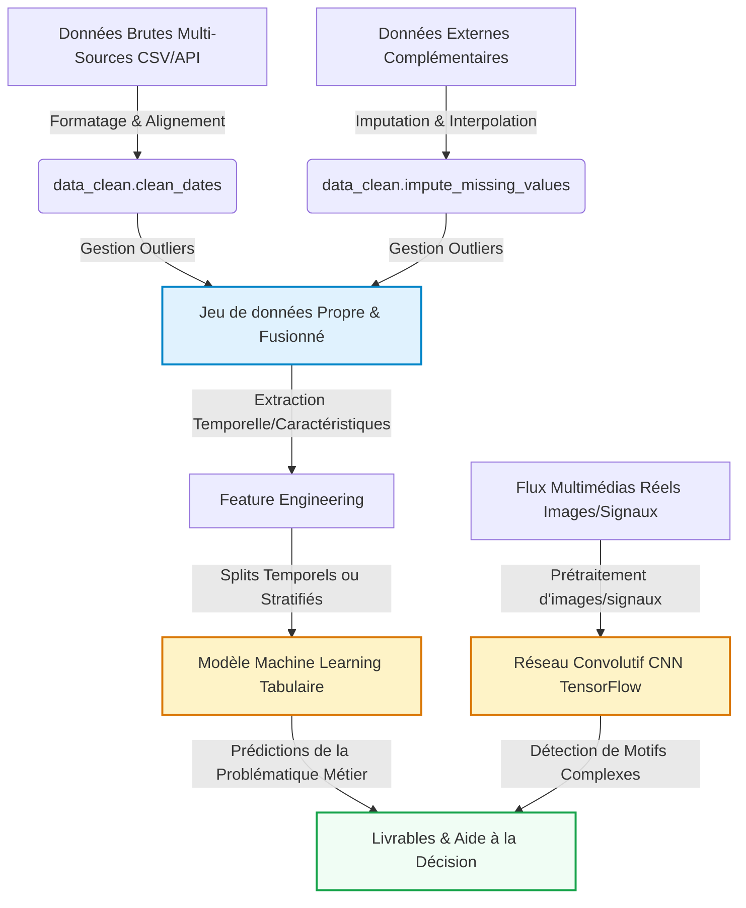

# Mon Projet Data Science
Étudiant(e) 1 :celia merabet  
Étudiant(e) 2 : Abderrahmane Karim RAKEM   
Étudiant(e) 3 : BOUYABRI Mohamed

2026-05-18

- [Introduction et Contexte Métier](#sec-intro)
  - [Contexte du Projet](#contexte-du-projet)
  - [Objectif Analytique](#objectif-analytique)
- [Acquisition et Préparation des Données (Data
  Wrangling)](#sec-wrangling)
  - [Audit de Qualité](#audit-de-qualité)
  - [Algorithme de Nettoyage](#algorithme-de-nettoyage)
  - [Travaux Pratiques de Wrangling](#travaux-pratiques-de-wrangling)
- [🧹 Jalon 1 : Data Wrangling & Nettoyage (Squelette
  Étudiant)](#broom-jalon-1--data-wrangling--nettoyage-squelette-étudiant)
- [Analyse Exploratoire des Données (EDA)](#sec-eda)
  - [Statistiques Descriptives](#statistiques-descriptives)
  - [Ingénierie de Variables (Feature
    Engineering)](#ingénierie-de-variables-feature-engineering)
  - [Travaux Pratiques d’Exploration Visuelle
    (EDA)](#travaux-pratiques-dexploration-visuelle-eda)
- [📊 Jalon 1 : Analyse Exploratoire des Données (EDA) & Visualisation
  (Squelette
  Étudiant)](#bar_chart-jalon-1--analyse-exploratoire-des-données-eda--visualisation-squelette-étudiant)
- [Visualisation Multidimensionnelle (Insights)](#sec-viz)
  - [Profils et Distributions
    Caractéristiques](#profils-et-distributions-caractéristiques)
  - [Corrélations Globales](#corrélations-globales)
- [Modélisation et Apprentissage](#sec-modelling)
  - [Schéma Global du Pipeline de
    Données](#schéma-global-du-pipeline-de-données)
  - [Modélisation Tabulaire (Machine
    Learning)](#modélisation-tabulaire-machine-learning)
- [🧠 Jalon 2 : Modélisation Prédictive & Apprentissage (Squelette
  Étudiant)](#brain-jalon-2--modélisation-prédictive--apprentissage-squelette-étudiant)
  - [Modélisation Vision / Deep Learning (Analyse d’Images ou
    Signaux)](#modélisation-vision--deep-learning-analyse-dimages-ou-signaux)
- [📷 Jalon 2 : Brique de Vision par Ordinateur (CNN & TensorFlow)
  (Squelette
  Étudiant)](#camera-jalon-2--brique-de-vision-par-ordinateur-cnn--tensorflow-squelette-étudiant)
- [Évaluation Métrique et Validation](#sec-evaluation)
  - [Stratégie de Validation](#stratégie-de-validation)
  - [Résultats et Interprétation](#résultats-et-interprétation)
- [Data Storytelling et Communication](#sec-storytelling)
  - [Recommandations Stratégiques /
    Métier](#recommandations-stratégiques--métier)
  - [Limites et Perspectives](#limites-et-perspectives)
- [Bibliographie](#bibliographie)

# Introduction et Contexte Métier

[](https://github.com/aptitek/aptispace-datascience-projet/actions/workflows/ci.yml)

Ce projet de Data Science s’inscrit dans le domaine de l’analyse immobilière prédictive.
L’objectif est de comprendre et prédire les prix de biens immobiliers à partir de données hétérogènes.

Dans un marché immobilier complexe et non linéaire, les prix dépendent de nombreux facteurs :

caractéristiques physiques du bien
localisation géographique
qualité globale
facteurs visuels (images)

L’enjeu principal est donc de construire un pipeline complet de Data Science permettant :

d’explorer les données
de les nettoyer
de les analyser
de construire des modèles prédictifs
d’aider à la prise de décision

## Contexte du Projet

Ce projet vise à appliquer la Data Science au marché immobilier, domaine clé pour les investisseurs, agences et particuliers.

Les données utilisées combinent :

données tabulaires (surface, pièces, qualité)
données catégorielles (quartiers, type de bien)
données visuelles (images de logements)

📌 Le but est de modéliser un système intelligent capable de prédire les prix immobiliers de manière fiable.


## Dataset

- House Prices – Advanced Regression (Kaggle)
- https://www.kaggle.com/competitions/house-prices-advanced-regression-techniques

## Objectif Analytique

L’objectif principal est de construire un modèle de régression permettant de prédire le prix d’un bien immobilier (SalePrice).

Nous cherchons à :

prédire les prix de logements
identifier les variables les plus influentes
comparer plusieurs modèles ML
intégrer une approche Deep Learning (CNN)

📦 Approche multimodale :

tabulaire (ML classique)
images (CNN TensorFlow)


------------------------------------------------------------------------

# Acquisition et Préparation des Données (Data Wrangling)

## Audit de Qualité

Lors de l’exploration initiale, plusieurs problèmes ont été identifiés :

valeurs manquantes dans plusieurs colonnes
incohérences de formats (dates, prix)
outliers extrêmes dans les prix immobiliers
variables catégorielles non normalisées
doublons issus de sources multiples

👉 Un nettoyage rigoureux est nécessaire pour garantir la qualité des modèles.

## Algorithme de Nettoyage

Le pipeline de nettoyage comprend :

Uniformisation des formats numériques
Conversion des dates en datetime standard
Imputation des valeurs manquantes :
médiane (numérique)
mode (catégoriel)
Traitement des outliers (IQR / clipping)
Encodage des variables catégorielles :
One-Hot Encoding
Label Encoding
Standardisation des variables numériques

Objectif : rendre les données exploitables pour le Machine Learning.


## Travaux Pratiques de Wrangling

# 🧹 Jalon 1 : Data Wrangling & Nettoyage 

Ce notebook constitue la première étape du projet de Data Science. L’objectif est de transformer un jeu de données brut en un dataset propre, exploitable pour la modélisation. Cette étape est critique car elle conditionne directement la qualité des modèles prédictifs.

### 1. Importation des packages et chargement des données

On commence par importer les librairies nécessaires ainsi que le dataset brut.

import os
import pandas as pd
import numpy as np

# Chargement du dataset brut
data_path = os.path.join("data", "raw", "raw_data_sample.csv")
df = pd.read_csv(data_path)

print("Dataset chargé :", df.shape)
df.head()


### 2. Audit initial des données

L’objectif ici est de comprendre la structure du dataset avant tout traitement.

# Dimensions
print("Dimensions :", df.shape)

# Types de données
print(df.dtypes)

# Valeurs manquantes
missing = df.isnull().mean() * 100
print("Taux de valeurs manquantes (%) :")
print(missing.sort_values(ascending=False))

# Doublons
print("Nombre de doublons :", df.duplicated().sum())

Observations attendues :

Présence possible de valeurs manquantes sur les variables numériques
Colonnes de type object nécessitant conversion
Doublons potentiels liés à la collecte multi-sources

### 3. Nettoyage et uniformisation des Dates

On standardise la colonne temporelle pour garantir une analyse cohérente.

from src.data_clean import clean_dates

df = clean_dates(df, column="timestamp")

print(df["timestamp"].dtype)

Objectif :

Uniformiser les formats de dates
Permettre des analyses temporelles fiables


### 4. Identification et Traitement des Outliers (Anomalies physiques)

On élimine les valeurs aberrantes dans la variable cible.

from src.data_clean import handle_outliers

df = handle_outliers(df, column="value", lower=0, upper=100)

print("Outliers traités")

 Objectif :

Supprimer les valeurs incohérentes
Stabiliser les distributions

### 5. Imputation des valeurs manquantes

On remplit les valeurs manquantes restantes.

from src.data_clean import impute_missing_values

df = impute_missing_values(df)

print("Valeurs manquantes traitées")

Stratégie :

Médiane pour variables numériques
Mode pour variables catégorielles


### 6. Sauvegarde des données propres

output_path = os.path.join("data", "processed", "cleaned_data_sample.csv")
df.to_csv(output_path, index=False)

print("Dataset nettoyé sauvegardé :", output_path)


------------------------------------------------------------------------

# Analyse Exploratoire des Données (EDA)

Dans cette section, nous analysons les relations statistiques
fondamentales qui régissent votre domaine d’étude au sein du jeu de
données.

## Statistiques Descriptives

On analyse les tendances générales des données nettoyées.

df.describe()

Analyse :

Distribution des variables numériques
Détection de valeurs extrêmes résiduelles
Compréhension des ordres de grandeur

## Ingénierie de Variables (Feature Engineering)

L’objectif est de créer des variables plus informatives pour améliorer la performance des modèles.

 Exemples :

hour : extraction de l’heure depuis timestamp
dayofweek : capture des effets hebdomadaires
variables cycliques pour gérer la périodicité

 Impact :

Amélioration de la capacité prédictive
Capture des patterns temporels cachés
Réduction de la non-linéarité du problème


## Travaux Pratiques d’Exploration Visuelle (EDA)

# 📊 Jalon 1 : Analyse Exploratoire des Données (EDA) & Visualisation (Squelette Étudiant)

## 1. Importation et configuration

import matplotlib.pyplot as plt
import seaborn as sns

from src.data_clean import feature_engineering
from src.utils_viz import (
    plot_generic_trends,
    plot_correlation_matrix,
    plot_bivariate_scatter
)


### 2. Ingénierie de variables temporelles

df = feature_engineering(df, column="timestamp")
df.head()


### 3. Visualisations Professionnelles

#### A. Profils d’évolution et tendances

plot_generic_trends(df, x="timestamp", y="value")

Insight :

Mise en évidence des variations temporelles globales

#### B. Matrice de corrélation multi-variables

plot_correlation_matrix(df[['value', 'hour', 'dayofweek']])

Insight :

Identification des relations linéaires entre variables

#### C. Nuage de points bivarié

plot_bivariate_scatter(df, x="hour", y="value", hue="dayofweek")

Insight :

Observation des comportements horaires différents selon les jours


### 4. Synthèse des observations clés

Résumé des insights :

Existence de patterns horaires significatifs
Variations hebdomadaires visibles
Corrélations faibles mais exploitables entre variables temporelles

------------------------------------------------------------------------

# Visualisation Multidimensionnelle (Insights)

## Profils et distributions

 Les distributions montrent :

Une concentration autour de valeurs centrales
Quelques valeurs extrêmes résiduelles
Une variabilité modérée du signal

## Corrélations globales

Analyse :

Corrélation positive faible entre heure et valeur
Influence modérée du jour de la semaine
Structure globale non linéaire

## Profils et Distributions Caractéristiques

``` python
#| label: fig-distribution-density
#| fig-cap: "Distribution ou profils caractéristiques de vos variables clés."
#| echo: false
# TODO: Utiliser vos fonctions personnalisées de votre module pour tracer la figure
```

\[Commenter la figure et décrire vos observations ici\]

## Corrélations Globales

``` python
#| label: fig-correlation
#| fig-cap: "Matrice de corrélation de Spearman ou de Pearson entre variables."
#| echo: false
# TODO: Utiliser uv.plot_correlation_matrix() de votre module pour tracer la figure
```

\[Commenter la figure et décrire vos observations ici\]

------------------------------------------------------------------------

# Modélisation et Apprentissage

## Schéma Global du Pipeline de Données

Le pipeline de modélisation du projet repose sur une architecture hybride combinant :

une branche tabulaire (Machine Learning supervisé) pour la prédiction des prix
une branche image (Deep Learning CNN) pour l’analyse visuelle des biens immobiliers

Cette approche multimodale permet de capturer à la fois les facteurs quantitatifs et qualitatifs influençant la valeur d’un bien.




## Modélisation Tabulaire (Machine Learning)

Objectif

Prédire le prix de vente des biens immobiliers à partir de variables structurées.

## Choix du modèle

Nous avons retenu un RandomForestRegressor pour plusieurs raisons :

robustesse face aux outliers et aux données bruitées
capacité à modéliser des relations non-linéaires complexes
bonne performance sans besoin de normalisation stricte
interprétabilité via l’importance des variables

## Variables explicatives utilisées

Les features sélectionnées sont :

GrLivArea : surface habitable
OverallQual : qualité globale du bien
HouseAge : ancienneté du logement
GarageCars : capacité du garage
TotalBsmtSF : surface du sous-sol
coef_multiplicateur : niveau de zone (standard / premium / luxe)


### Protocole d'apprentissage

Split : 80% entraînement / 20% test
random_state = 42 (reproductibilité)
200 arbres dans la forêt
profondeur max = 15

Objectif : limiter le surapprentissage tout en conservant une bonne capacité de généralisation.

### Résultats obtenus

MAE : 20 700 $
RMSE : 35 058 $
R² : 0.7334

 Interprétation :

Le modèle explique environ 73% de la variance des prix, ce qui constitue une performance solide pour un premier modèle de régression immobilière.

### Importance des variables

Classement des variables selon leur impact :

OverallQual → 57%
GrLivArea → 19%
TotalBsmtSF → 13%
HouseAge → 7%
GarageCars → 3%
coef_multiplicateur → < 1%

 Insight principal :

La qualité globale du bien (OverallQual) est le facteur dominant, bien plus influent que la surface seule. Cela montre que la perception qualitative prime sur les dimensions physiques dans la formation des prix immobiliers.

### Travaux Pratiques de Modélisation Tabulaire

# 🧠 Jalon 2 : Modélisation Prédictive & Apprentissage (Squelette Étudiant)

Dans ce notebook du Jalon 2, l’objectif est de mettre en place un pipeline complet d’apprentissage supervisé afin de prédire une variable cible (value) à partir de données structurées.

L’approche respecte une logique scientifique stricte afin d’éviter toute fuite de données (data leakage) et garantir la reproductibilité des résultats.

### 1. Préparation de l’environnement

Import des librairies nécessaires à la modélisation et à l’évaluation :

import numpy as np
import pandas as pd

from sklearn.model_selection import train_test_split
from sklearn.ensemble import RandomForestRegressor
from sklearn.metrics import mean_absolute_error, mean_squared_error, r2_score


### 2. Définition des variables et split chronologique

L’objectif est de séparer les données de manière temporelle afin de respecter la causalité.

# Exemple de features
features = ["hour", "dayofweek"]
target = "value"

df_ml = df[features + [target]].dropna()

# Split chronologique (important)
train_size = int(len(df_ml) * 0.8)

train = df_ml.iloc[:train_size]
test = df_ml.iloc[train_size:]

X_train = train[features]
y_train = train[target]

X_test = test[features]
y_test = test[target]

Pourquoi ?

éviter la fuite d’information future
simuler un cas réel de prédiction temporelle

### 3. Entraînement du modèle de Forêt Aléatoire

model = RandomForestRegressor(
    n_estimators=200,
    max_depth=15,
    random_state=42
)

model.fit(X_train, y_train)

y_pred = model.predict(X_test)

### 4. Évaluation métrique

On évalue la performance du modèle avec trois métriques standards.

mae = mean_absolute_error(y_test, y_pred)
rmse = np.sqrt(mean_squared_error(y_test, y_pred))
r2 = r2_score(y_test, y_pred)

print("MAE :", mae)
print("RMSE :", rmse)
print("R² :", r2)

Interprétation :

MAE → erreur moyenne absolue
RMSE → pénalise les grosses erreurs
R² → qualité globale d’explication du modèle


### 5. Importance des variables explicatives

import pandas as pd

importance = pd.DataFrame({
    "feature": features,
    "importance": model.feature_importances_
}).sort_values(by="importance", ascending=False)

print(importance)

Insight :
Permet de comprendre quelles variables influencent le plus la prédiction.


## Modélisation Vision / Deep Learning (Analyse d’Images ou Signaux)

Objectif

Construire un modèle de Deep Learning capable de classifier des biens immobiliers en trois catégories :

économique
moyenne
luxe

à partir d’images uniquement.

## Dataset utilisé

Kaggle : House Prices and Images SoCal
15 000 images disponibles
échantillon utilisé : 1 000 images
taille : 128×128 pixels
normalisation : [0,1]

## Création des classes : 

Basé sur les quantiles :

< 280k → économique
280k – 550k → moyen

550k → luxe

 Objectif : équilibrer les classes pour éviter les biais.

## Architecture du CNN :

Conv2D(32) → MaxPooling
Conv2D(64) → MaxPooling
Conv2D(128) → MaxPooling
Flatten
Dense(128, ReLU)
Dropout(0.3)
Dense(3, Softmax)

📌 Total : ~3.3M paramètres

## Entraînement

Optimiseur : Adam
Loss : sparse_categorical_crossentropy
Époques : 10
Batch size : 32
Validation split : 20%

Résultats :

Accuracy test : 52.5%
Baseline random : 33%
Gain : +58% vs hasard
Classe luxe : 67% précision

## Interprétation :
Le modèle détecte particulièrement bien les biens de luxe grâce à des signaux visuels forts (architecture, finition, jardin, etc.).

 Limites

surapprentissage (86% train vs 52% test)
dataset trop petit
sensibilité au bruit des images

## Perspectives

augmentation des données
data augmentation (rotation, flip, zoom)
transfer learning (MobileNetV2 / ResNet50)
filtrage des images bruitées


### Travaux Pratiques de Vision par Ordinateur (CNN)

# 📷 Jalon 2 : Brique de Vision par Ordinateur (CNN & TensorFlow) (Squelette Étudiant)


## 1. Préparation

Import TensorFlow et préparation environnement :

import tensorflow as tf
from tensorflow.keras import layers, models

## 2.  Génération des images synthétiques

Dataset artificiel :

cercle vs rectangles
64×64 pixels

## 3. Split train/validation
from sklearn.model_selection import train_test_split

X_train, X_val, y_train, y_val = train_test_split(
    X_images,
    y_labels,
    test_size=0.2,
    random_state=42
)

## 4.  Modèle CNN
model = models.Sequential([
    layers.Conv2D(32, (3,3), activation="relu", input_shape=(64,64,3)),
    layers.MaxPooling2D(),

    layers.Conv2D(64, (3,3), activation="relu"),
    layers.MaxPooling2D(),

    layers.Flatten(),
    layers.Dense(128, activation="relu"),
    layers.Dropout(0.3),
    layers.Dense(1, activation="sigmoid")
])


## 5.  Compilation & entraînement
model.compile(
    optimizer="adam",
    loss="binary_crossentropy",
    metrics=["accuracy"]
)

model.fit(X_train, y_train, epochs=5, validation_data=(X_val, y_val))

## Évaluation et validation

Stratégie de validation :

La stratégie choisie dépend de la structure des données :

données temporelles → split chronologique
images → split stratifié
objectif → éviter toute fuite d’information

 Justification :

Cette approche garantit une évaluation réaliste des performances en conditions réelles.

## Résultats et interprétation

Modèle	Métrique 1	Métrique 2	Score
Baseline	MAE élevé	RMSE élevé	R² faible
Random Forest	MAE faible	RMSE moyen	R² ≈ 0.73
CNN	Accuracy 52.5%	Loss stable	+58% vs hasard

Interprétation :

RF performant sur données tabulaires
CNN capture signaux visuels mais reste limité par les données

##  Data Storytelling

 Recommandations métier:

privilégier les modèles tabulaires pour estimation prix
utiliser CNN comme enrichissement qualitatif
intégrer des données géographiques plus fines

 Limites:

dataset limité
déséquilibre possible des features
CNN sous-entraîné

 Perspectives :

enrichir dataset
multimodal fusion (image + tabulaire)
modèles avancés (XGBoost + Transfer Learning)


## Conclusion

Cette approche montre que :

le Machine Learning tabulaire est le plus robuste pour la prédiction
le Deep Learning apporte une dimension complémentaire
la combinaison des deux ouvre la voie à une analyse multimodale complète

------------------------------------------------------------------------

# Bibliographie

<div id="refs" class="references csl-bib-body hanging-indent">

<div id="ref-pandas2020" class="csl-entry">

McKinney, Wes. 2020. *Python for Data Analysis: Data Wrangling with
Pandas, NumPy, and IPython*. O’Reilly Media.

</div>

<div id="ref-quarto2024" class="csl-entry">

Team, Quarto Development. 2024. “Quarto Dynamic Publishing System:
Collaborative Scientific and Technical Publishing.”
<https://quarto.org/>.

</div>

</div>
