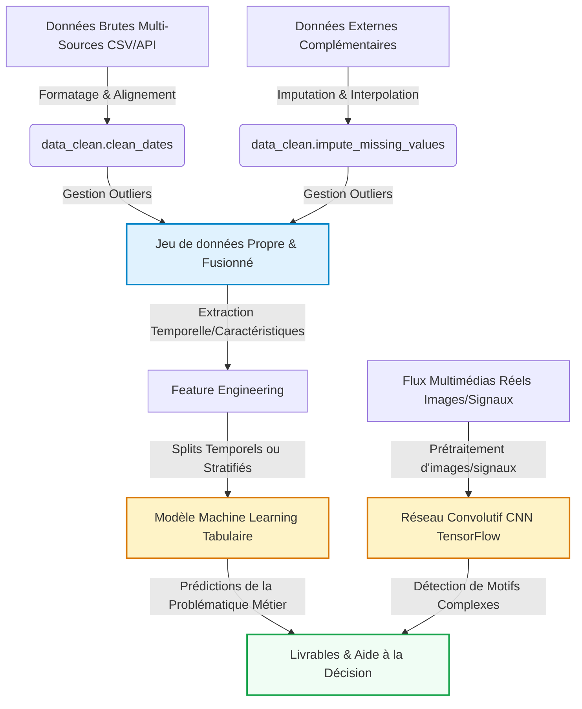

# Introduction et Contexte Métier {#sec-intro}

[](https://github.com/aptitek/aptispace-datascience-projet/actions/workflows/ci.yml)

*À rédiger par les étudiants : Présentez ici le contexte global de votre projet, la problématique métier que vous cherchez à résoudre, les questions scientifiques soulevées et les opportunités d'aide à la décision sur la base de vos données.*

## Contexte du Projet
*À rédiger par les étudiants — Pistes de réflexion :*
- *Quels sont les objectifs globaux et le domaine d'étude de votre projet ?*
- *En quoi ce sujet de recherche est-il pertinent et stratégique ?*
- *Pourquoi l'analyse quantitative de ce jeu de données est-elle indispensable pour répondre à votre problématique ?*

[Rédiger votre paragraphe de contexte ici]

## Objectif Analytique
*À rédiger par les étudiants — Pistes de réflexion :*
- *Quelles sont les variables cibles principales et la tâche globale de modélisation (classification, régression, clustering, etc.) ?*
- *Comment le couplage de données multi-sources et l'intégration de différents types de données (tabulaires, images, signaux, etc.) enrichissent-ils l'analyse ?*
- *Quels sont les livrables analytiques attendus pour répondre à votre problématique et guider les prises de décisions ?*

[Rédiger votre paragraphe d'objectifs ici]

---

# Acquisition et Préparation des Données (Data Wrangling) {#sec-wrangling}

Le succès de tout projet de Data Science repose sur la qualité de la préparation des données [@pandas2020]. Cette section documente l'audit de qualité et les étapes de nettoyage appliquées à vos jeux de données bruts.

## Audit de Qualité
*À rédiger par les étudiants : Présentez un audit critique complet de vos fichiers de données brutes. Indiquez la liste des anomalies physiques et typologiques détectées (formats de dates hétérogènes, outliers physiques, taux de valeurs manquantes, etc.).*

[Rédiger votre audit de données ici]

## Algorithme de Nettoyage
*À rédiger par les étudiants : Justifiez et détaillez l'enchaînement de vos opérations de traitement (uniformisation des dates, masquage des outliers, imputation, etc.). Faites référence aux fonctions correspondantes de votre module `src/data_clean.py`.*

[Rédiger la justification méthodologique ici]

## Travaux Pratiques de Wrangling


---

# Analyse Exploratoire des Données (EDA) {#sec-eda}

Dans cette section, nous analysons les relations statistiques fondamentales qui régissent votre domaine d'étude au sein du jeu de données.

## Statistiques Descriptives
*À rédiger par les étudiants : Présentez une vue d'ensemble descriptive rapide de vos variables nettoyées.*

[Rédiger les statistiques descriptives ici]

## Ingénierie de Variables (Feature Engineering)
*À rédiger par les étudiants : Expliquez l'intérêt mathématique et l'impact sur les modèles prédictifs d'extraire des caractéristiques dérivées (ex: variables cycliques temporelles, ratios financiers, ratios physiques, etc.).*

[Rédiger votre explication de l'ingénierie de variables ici]

## Travaux Pratiques d'Exploration Visuelle (EDA)


---

# Visualisation Multidimensionnelle (Insights) {#sec-viz}

Nous présentons ici les résultats visuels clés permettant de dégager des insights exploitables pour les décideurs, en s'appuyant sur notre module `src/utils_viz.py`.

*À rédiger par les étudiants : Présentez et commentez en détail vos 3 à 5 insights majeurs découverts lors de l'exploration descriptive visuelle. Intégrez et justifiez les figures clés générées.*

## Profils et Distributions Caractéristiques
```python
#| label: fig-distribution-density
#| fig-cap: "Distribution ou profils caractéristiques de vos variables clés."
#| echo: false
# TODO: Utiliser vos fonctions personnalisées de votre module pour tracer la figure
```
[Commenter la figure et décrire vos observations ici]

## Corrélations Globales
```python
#| label: fig-correlation
#| fig-cap: "Matrice de corrélation de Spearman ou de Pearson entre variables."
#| echo: false
# TODO: Utiliser uv.plot_correlation_matrix() de votre module pour tracer la figure
```
[Commenter la figure et décrire vos observations ici]

---

# Modélisation et Apprentissage {#sec-modelling}

## Schéma Global du Pipeline de Données
Le pipeline complet intègre à la fois la branche analytique tabulaire (Machine Learning) et la branche d'analyse visuelle ou de signaux complexes (Deep Learning CNN) :



## Modélisation Tabulaire (Machine Learning)
*À rédiger par les étudiants : Expliquez le choix de vos algorithmes d'apprentissage (supervisé ou non supervisé) et décrivez l'importance des variables explicatives.*

[Détailler votre modélisation ici]

### Travaux Pratiques de Modélisation Tabulaire


## Modélisation Vision / Deep Learning (Analyse d'Images ou Signaux)
*À rédiger par les étudiants : Expliquez l'intérêt de la brique de Deep Learning (images, signaux ou traitement de données structurées complexes) pour classifier ou enrichir vos prédictions. Détaillez l'architecture de votre réseau de neurones convolutif (CNN) conçu sous TensorFlow/Keras (conv, pooling, dense, dropout, activation) et commentez les courbes d'apprentissage obtenues.*

[Détailler votre architecture CNN et analyse ici]

### Travaux Pratiques de Vision par Ordinateur (CNN)


---

# Évaluation Métrique et Validation {#sec-evaluation}

## Stratégie de Validation
*À rédiger par les étudiants : Expliquez pourquoi le découpage d'évaluation choisi (ex: validation temporelle, stratifiée ou par groupe) est adapté à la structure de vos données pour éviter les fuites de données.*

[Rédiger la section de validation ici]

## Résultats et Interprétation
*À rédiger par les étudiants : Complétez le tableau d'évaluation ci-dessous en reportant vos résultats de modélisation.*

| Modèle | Métrique 1 (ex: MAE / Précision) | Métrique 2 (ex: RMSE / F1-Score) | R² / Score (%) |
|--------|-----------------|------------------|-----------|
| Baseline (ex: Naïve / Moyenne) | [À compléter] | [À compléter] | [À compléter] |
| **Modèle Choisi** | **[À compléter]** | **[À compléter]** | **[À compléter]** |

[Interpréter et comparer les métriques d'erreur calculées ici]

---

# Data Storytelling et Communication {#sec-storytelling}

## Recommandations Stratégiques / Métier
*À rédiger par les étudiants : Formulez des recommandations stratégiques, opérationnelles et innovantes basées sur vos découvertes analytiques et prédictives pour guider les décideurs.*

[Rédiger vos recommandations ici]

## Limites et Perspectives
*À rédiger par les étudiants : Identifiez honnêtement les biais ou limites de votre approche et proposez des pistes d'amélioration futures (ex: intégration de données externes réelles, modélisation plus poussée).*

[Rédiger les limites et perspectives ici]

Ce document dynamique a été compilé en Quarto [@quarto2024].

---

# Bibliographie {.unnumbered}

::: {#refs}
:::
